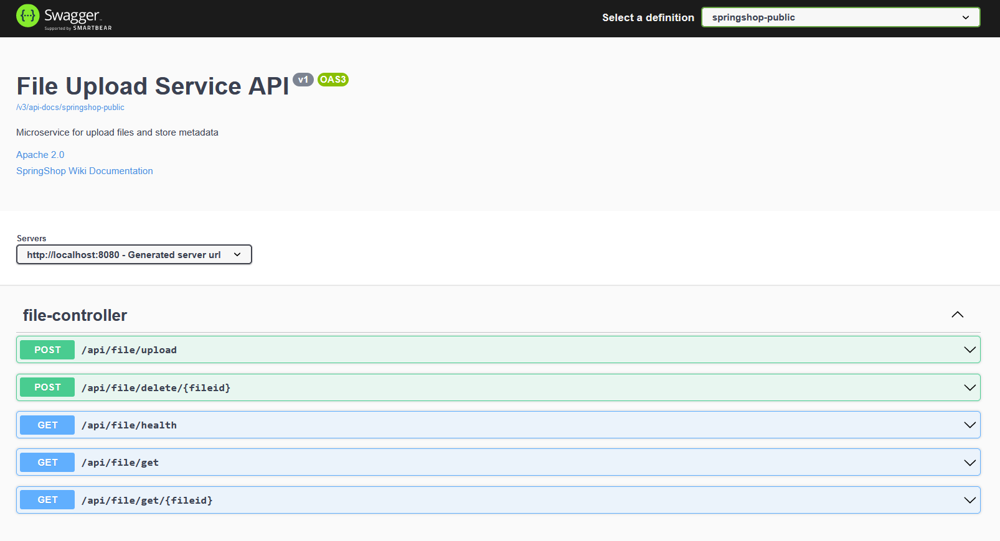
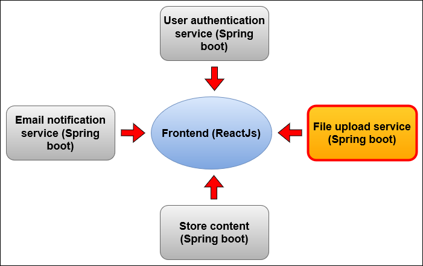
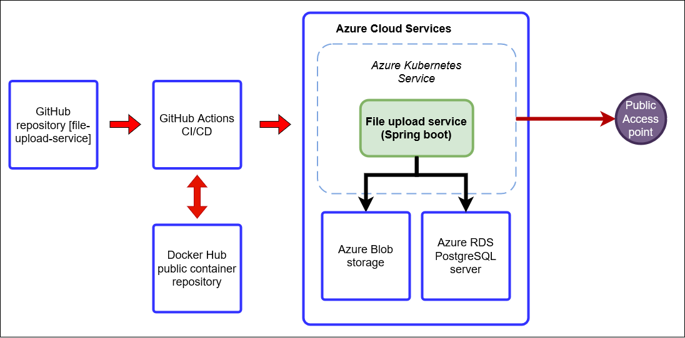
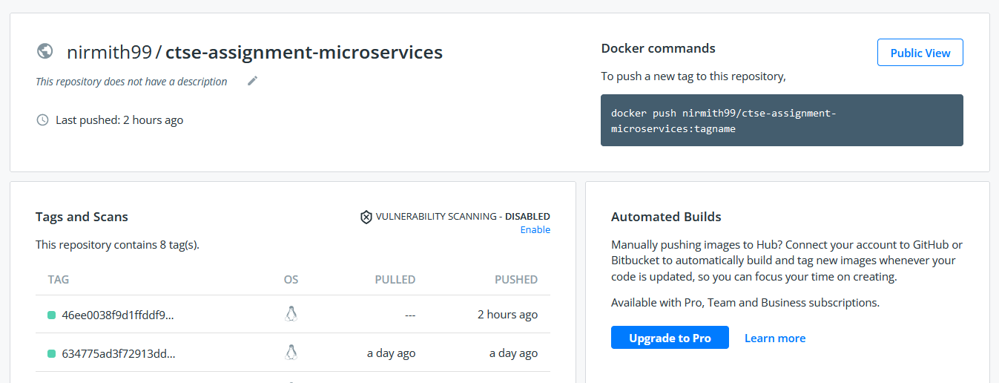

# CTSE - Assignment 3 - Microservices - File Upload Service



Swagger documentation of the file upload service.



High Level system overview diagram.



High Level function overview diagram.


## About

Dual database solution for upload files and maintain metadata. Uploaded files are maintained in Azure blob storage and metadata will kept in a postgreSQL flexible server deployed in Azure.

## CI/CD Workflow

CI/CD workflow is enable for this project using GitHub actions. Build, push and deployment automation is set to 
master branch. When push or a pull request is made to the master branch it will trigger the GitHub actions flow, which will
build the maven project and build the docker image and then it will push the image to public docker hub. Git sha will be used to tag the images for better management purpose.

**Following are the documents that need for the deployment automation**

* .github/workflows/maven.yml
* k8s/deployment.yml
* k8s/service.yml

## Setting up the project (Maven)

* Use the following link to download the startup template for spring boot java application with preferred JDK version and dependecies.
[Spring Initializr](https://start.spring.io/)
* Issues the command `mvn clean install` to install the dependencies and run the application.
* Application can be run with `java -jar app.jar`

## Building the docker image.

Docker images for the maven projects are usually extremely simple compared to nodeJs,
Include the following lines in the docker image to start building the docker image and push to the public repository.

```dockerfile
FROM openjdk:11
EXPOSE 8080
ADD target/assignment-0.0.1-SNAPSHOT.jar app.jar
ENTRYPOINT ["java", "-jar", "/app.jar"]
```

**Following are the commands to build and push the docker image to the docker hub**

* Build the docker image with Dockerfile
```dockerfile
docker build -t '${{secrets.DOCKER_LOGIN}}'/ctse-assignment-microservices:'${{github.sha}}' .
```

* Push the image to the public docker repository
```dockerfile
docker push '${{secrets.DOCKER_LOGIN}}'/ctse-assignment-microservices:'${{github.sha}}'
```



## Pushing the image file and run in the kubernetes cluster.

**Steps to create a Kubernetes cluster in Azure**
create a kubernetes cluster in production mode or dev/test mode with ``http`` enabled.
Then edit the `.github/workflows/maven.yml` with the correct name of the cluster.

* ⚠️ Make sure to add the ``AZURE_CREDENTIALS`` to the github repository secrets.

How to obtain the ``AZURE_CREDENTIALS``?
```dockerfile
az ad sp create-for-rbac --name "ctse-file-service" --role contributor --scopes /subscriptions/<subscription-id>/resourceGroups/<resource-group-name> --sdk-auth
```
Paste the above command in the Azure CLI (Make sure login to the CLI before)
Once executed the above command (⚠️replace the subscription-id and the resource-group), then following json output will display.

```json
{
"clientId": "xx",
"clientSecret": "xx",
"subscriptionId": "xx",
"tenantId": "xx",
"activeDirectoryEndpointUrl": "xx",
"resourceManagerEndpointUrl": "xx",
"activeDirectoryGraphResourceId": "xx",
"sqlManagementEndpointUrl": "xx",
"galleryEndpointUrl": "xx",
"managementEndpointUrl": "xx"
}
```

Copy paste the entire ``json`` file to the GitHub secret with the key ``AZURE_CREDENTIALS`` and save.
⚠️Make sure the do the same to above Dockerfile ``DOCKER_USERNAME`` and ``DOCKER_PASSWORD``

**Following are the commands to push create a kubernetes cluster and run the application**
⚠️These commands are for the YML file.

```yaml
- name: Deploy to Kubernetes cluster
      uses: Azure/k8s-deploy@v1
      with:
        # Path to the manifest files which will be used for deployment.
        manifests: |
          k8s/deployment.yml
          k8s/service.yml
        # Fully qualified resource URL of the image(s) to be used for substitutions on the manifest files Example: contosodemo.azurecr.io/helloworld:test
        images: '${{secrets.DOCKER_LOGIN}}/ctse-assignment-microservices:${{github.sha}}'
        # Name of a docker-registry secret that has already been set up within the cluster. Each of these secret names are added under imagePullSecrets field for the workloads found in the input manifest files
        imagepullsecrets: docker-image-pull-secret
        # deploy/promote/reject
        action: deploy
```
_Complete code is given in the provided maven.yml file_


